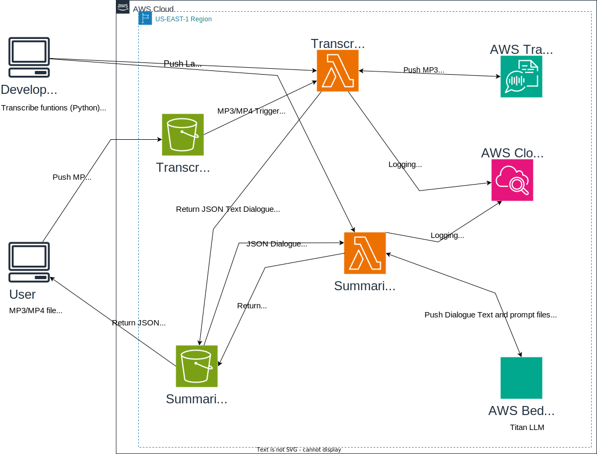

# AWS Example of Audio file to Summarization using AWS Machine Learning Technology

The goal is to take audio files, such as ones created from Zoom, and create a summarization, with sentiment, of dialogue using AWS services.

Like many existing services, the Python notebook will take a small MP3 audio file, transcribe it to text, and create a dialogue summarization using a Large Language Model. The application utilizes the following AWS services:

- S3 - Used to store files between the operations
- Lambda - Executes the Python code which manage the summarization operations
- Transcribe - Converts the audio file into a transcription output in JSON format
- Bedrock - Provides the LLM (Titan) to create the summarization of the dialogue
- Cloudwatch - To record events generated from the code running in Lambda

By creating this project, it provides more control over what is generated in the summarization and data privacy verses using a third party.

## Pre-configured Requirements
- Two S3 buckets   
- IAM policies for Bedrock, Cloudwatch, Lambda, S3 Bucket
- IAM role for the Lambda functions

The project is divided into three parts:

## Part 1: Push the Python code and prompt files into the AWS Lambda service
The python code is located in the AudioSummarizer Juypter notebook and in AWS helper functions. The notebook code will write the Lambda transcribe code, summarization code, and prompt file to local disk. The notebook will configure the Lambda Transcribe and Summarize functions (prompt text included). It will configure both S3 buckets to trigger notify the Lambda functions when a file is written into the bucket folders. Using an AWS provided helper function, it will configure the Lambda service with the functions and prompt file.

At this time Lambda did not support BOT3 and Bedrock modules, and a layer has to be created using the Lambda layers feature (bedrock_python_modules).

## Part 2: Using the AWS Transcribe service, convert the MP3 to transcription JSON file
The audio file is uploaded to a folder on the Transcribe S3 bucket which triggers the Lambda Transcribe function. The function orchestrates loading the file into the Transcribe service and writing the transcription JSON file to the Summarization S3 bucket folder.

## Part 3: Create the Summarization of the dialogue 
The writing of the transcription output file triggers the Lambda Summarization function. The function loads the JSON file and extracts the speaker dialogues from the Transcription JSON output into text transcript. The latter file and the prompt are passed to the Bedrock managed LLM (Titan). In this release it is important that tokens use does not exceed the LLM context window. The LLM produces the summarization in a JSON file and returns it to the Lambda function, which writes the file to the Summarization S3 bucket.The user will retrieve the summarization file from S3

### Next Steps
Resolve the context size constraint issue.

### References
DeepLearning.ai's Serverless LLM apps with Amazon Bedrock with Mike Chambers
